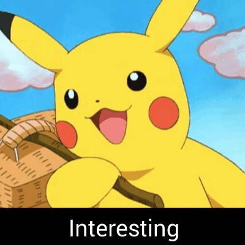
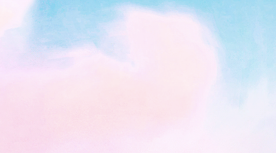
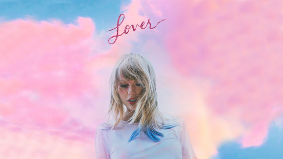
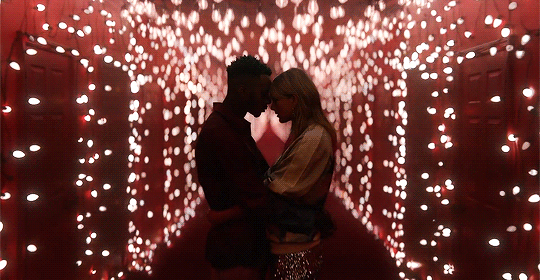
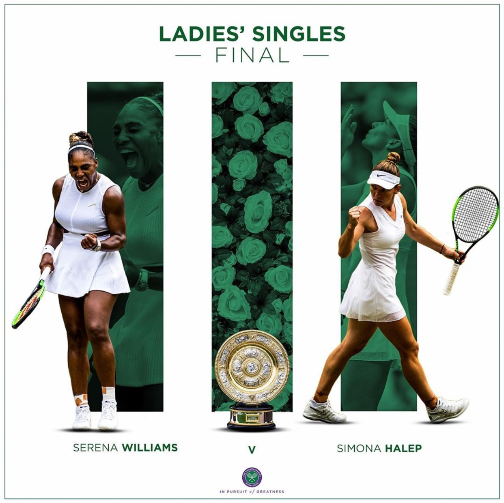

## Welcome to ZZH's Page

### Here is a brief introduction of myself.  
#### *Short, but interesting~*
#### 🌈🌈 

## Basic Information
 * Name:  Zihan Zhao/ Hannah
 * Sex:  Female
 * Date of birth:  20-05-1997
 * Nationality:  China
 * Occupation:  Student
 * E-mail:  zh-zhao19@mails.tsinghua.edu.cn
 
---

## Current Goals
 * **Be active and healthy**
   * Early to bed
   * Keep practicing boxing 🥊🥊
   * No sweet food ~~🍬🍦☕️🍰🍹~~
   
 * **Be more hard-working**
   * Machine learning
   * Foreign languages
   * Protein structure prediction
   
---

## Idols
### 🦋🦋 Taylor Swift
The latest album of Taylor called [***Lover***](https://music.163.com/#/album?id=80752440)  has been released recently. **Listen and share your feelings** with me **!!!**

---

---

>### Lyrics of ***Lover***   
>---  
>***And there's a dazzling haze, a mysterious way, about you dear.***    
>  
>***Have I known you twenty seconds or twenty years?***  

---

>### Music Videos  
>---  
>***[You need to calm down](https://music.163.com/#/mv?id=10873182)***
>  
>***[Lover](https://music.163.com/#/mv?id=10886105)***  

### 🎾🎾 Simona Halep

 * **A professional tennis player** from Romania
 * Current **world no.6** (14-09-2019) and **former world no.1** (05-10-2017 for the first time)
 * **Two-time grand slam champion** (French Open, 2018. Wimbledon, 2019)
 * The **loveliest and kindest** person in the world
 
Now let's take a look back at **Simona's impressive performance in 2019 Wimbledon Women's Singles Final !!!**  
  [🏆🏆](https://www.iqiyi.com/v_19rs1nsfek.html#curid=3352211600_226792c87abe7d92eaf9d85a997c3fd8) click on me

---

 

By the way, recently I've been using **Ora2 me BREATH & STAIN CLEAR Mouthwash** (Juicy Apple), which is **super mild and useful**.   
---------------------------------------------🌺🌺  Highly recommended  🌺🌺---------------------------------------------
